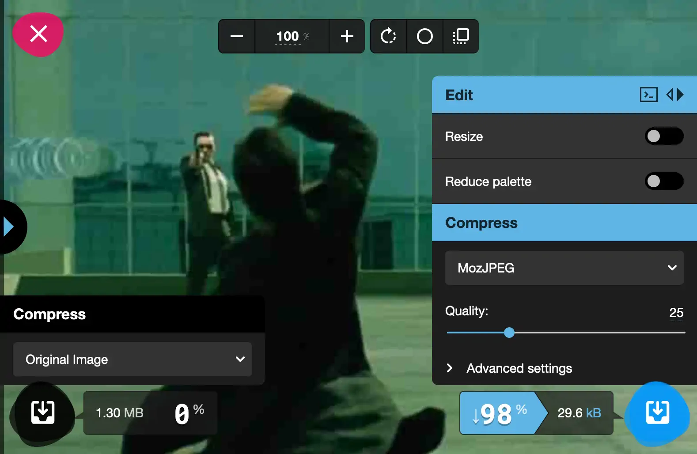
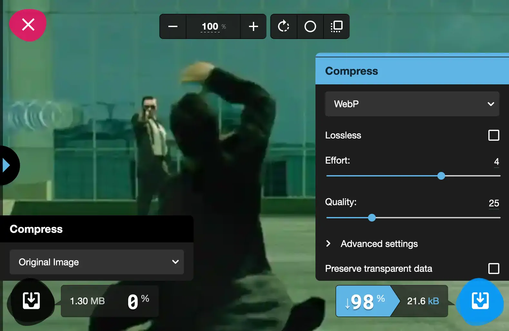
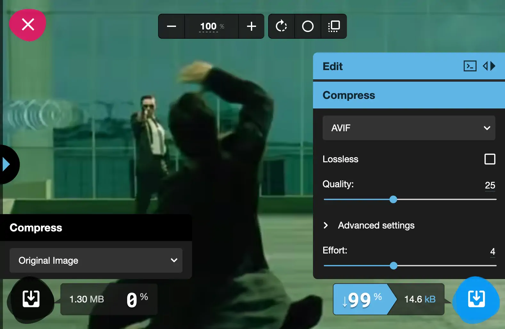

Scroll Frames is based on CSS and Javascript, thus, it supports any image format the browser supports. Even if Scroll Frames is able to have multiple instance on a single page, user must be aware of the following notes:

* Vector images frames are supported
* For raster image format, it is highly recommended to use [WebP image format](https://en.wikipedia.org/wiki/WebP)
* Page performances depend on frames sizes and compression.
* Higher amounts of frames - over 200 - decreases performance, the more on low-end devices
* Consider not exceeding an image sequence over 2MB for a single animation

| Raster file | Size | Support (% of users)1 |
|:- |:- |:- |
| **PNG** (Source image w/ lossless compression) | 1 331 kB | 99.99% |
| **JPEG** (approx. w/ quality set to 30) | 29.6 kB| 99.99% |
| **WebP** (approx. w/ quality set to 30) | 21.6 kB| 95% |
| **AVIF** (approx. w/ quality set to 30) | 14.6 kB| 69% |

(1) Source https://caniuse.com march 2022

Illustrations below shows renders in different image formats from [https://squoosh.app](https://squoosh.app)

JPEG | Widely supported

WebP | Recommened format, good support [learn more](https://caniuse.com/webp)

AVIF | The most powerful image compression but low brower support [learn more](https://caniuse.com/avif)
